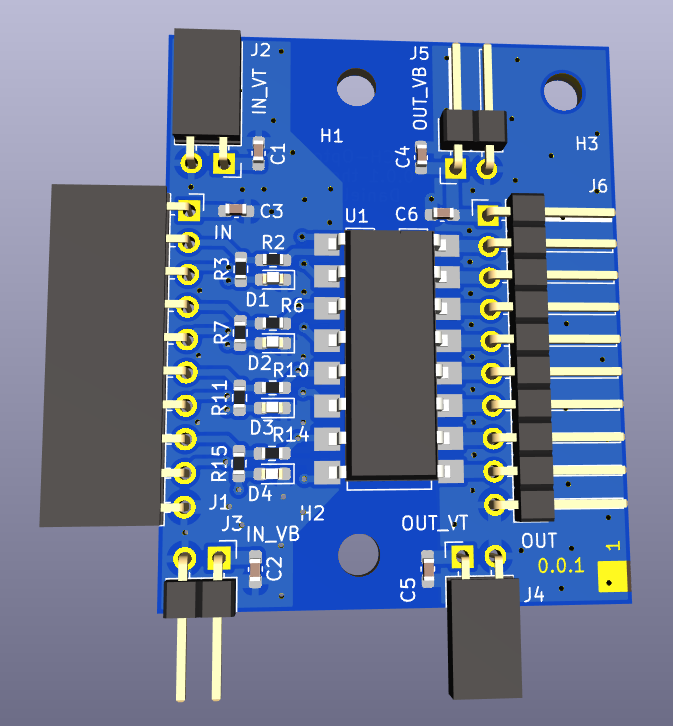

# 4CH-Opto-Iso

A 4 Channel Opto Isolator

The schematic can be found [here](doc/4CH-Opto-ISO.pdf).

To access the bom, use this link: https://htmlpreview.github.io/?https://github.com/the78mole/4CH-Opto-Iso/blob/main/bom/ibom.html
